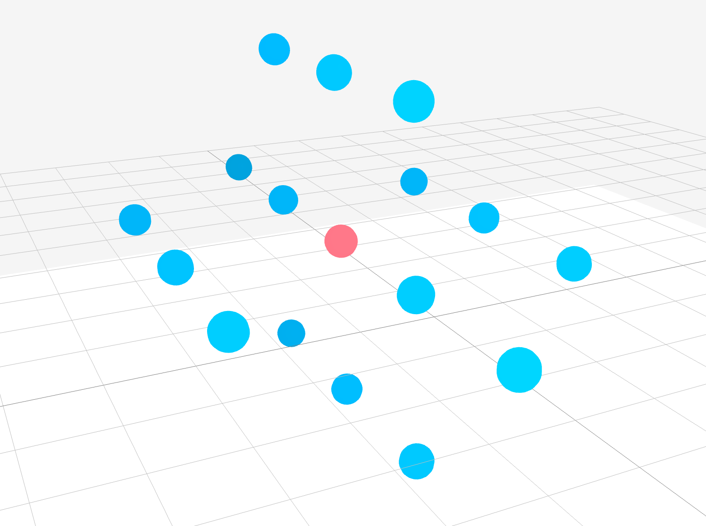

# Ketu

Lightweight framework to simulate drone formations.

Ketu provider simple abstractions to mimick the sensors available on drones and create
scenarios to see how the drones react to each other in the world.

## Why use Ketu?

Ketu provides a sandbox for people to quickly try out new drone formation techniques 
without amount of large setup.
For a more detailed simulation you can use ROS but to quickly try out
a formation algorithm Ketu is your best bet.

## Key Concepts

Ketu takes a simplistic approach to how simulations are done.
Every simulation is modelled as a scenario.
You can add multiple nodes to your world in a scenario.

Each node has access to a sensing client and a communication client.
You can use the sensing client to get information about objects in the world
and you can use the communication client to send messages to other objects.
Simple implementations of these clients are provided, but you are encouraged to 
extend these clients to create your own clients. 

Creating drone formations is handled by formation co-ordinators through message passing between nodes.
The grid formation coordinator aligns randomly placed nodes into a grid formation.
You can create more complex formation co-ordinators by extending the interface.

Checkout the RandomNodes scenarios in the scenarios directory to get started.

## It's easy to setup!

Ketu has very few dependencies namely
 - [Raylib](https://www.raylib.com)

That's it, once you have raylib installed on your machine you're good to go.

## Contributions

Contributions are welcome. Just keep it simple, avoid complex design patterns unless necessary.

